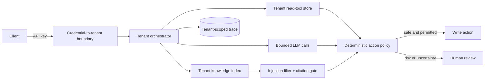

# Architecture

The service is an explicit pipeline: precheck, classify, retrieve, plan tools, execute read-only
tools, resolve, verify grounding, decide, and optionally execute an approved action. Every loop has
a configured ceiling. The model proposes; deterministic code validates and decides.

The provider contract accepts messages and a JSON schema. The fake provider uses the same prompt
and schema boundary as Anthropic, keeping normal tests deterministic without replacing the
orchestrator with fixture lookups. Provider transport errors, refusals, malformed output, semantic
grounding failures, and empty retrieval each retain distinct types and terminal states.

Policy documents are Markdown with versioned chunk identifiers. BM25 is appropriate for this
small, vocabulary-aligned corpus and makes retrieval inspectable. A citation passes only when its
chunk was retrieved for that run and its normalized quote occurs verbatim in that chunk.

Tenant identity is derived from the API credential, never accepted from the request body. It
selects an isolated knowledge index, tool-data root, and orchestrator before retrieval. Database
reads, idempotency, traces, and review queues carry the same tenant predicate. Cross-tenant object
lookups deliberately return `404` so they do not disclose that an identifier exists.

The workflow depends on a `Retriever` protocol rather than BM25 directly. An optional local Ollama
embedding adapter, in-memory cosine index, and deterministic Reciprocal Rank Fusion layer allow a
measured hybrid experiment. They are not enabled by default and are not presented as superior
until the same labelled dataset proves it.

Retrieved policy text is still untrusted input. Chunks matching indirect-injection patterns are
removed before prompt construction, recorded in the retrieval step, and retain an escalation
signal for the action gate. This is one defense layer, not a claim of complete injection detection.

SQLite is the local default. SQLAlchemy confines backend differences to engine construction, and
the CI matrix includes PostgreSQL. Each run persists its state-machine steps, provider attempts,
retrieved and cited evidence, validated tool arguments, outcome, cost, and review record.
The authenticated metrics endpoint aggregates only counts, rates, and latency; it does not load
ticket text, prompt bodies, or provider payloads.
